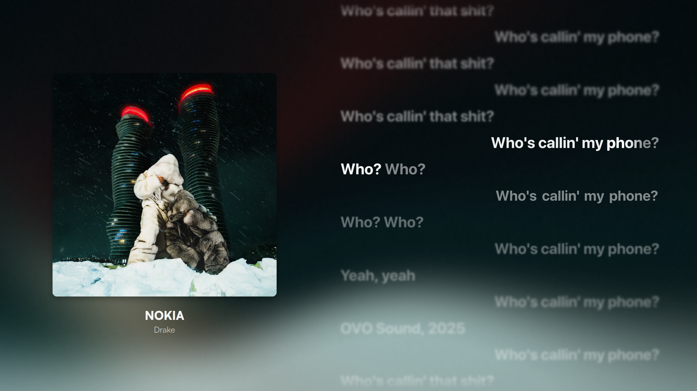

# Spicy for YouTube Music

A [Better Lyrics](https://github.com/better-lyrics/better-lyrics) theme that brings the [Spicy Lyrics](https://github.com/Spikerko/spicy-lyrics) look to YouTube Music.

See [DESCRIPTION.md](DESCRIPTION.md) for the full feature list.

## Install

- **From the store:** Better Lyrics options, **Themes**, **Browse Themes**, then search for "Spicy".
- **From this repo:** Better Lyrics options, **Themes**, **Install from URL**, then paste this repository's URL.
- **By hand:** Better Lyrics, **Edit CSS**, **Import from file**, then pick `style.css`. For the matching background, import `shader.json` in the Better Lyrics Shaders popup.

## Tuning

Open `style.css` and edit the **Tunables** block at the top.
